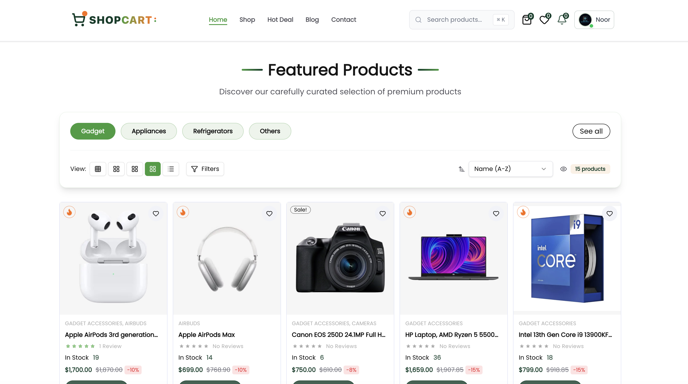

# 🛒 ShopCart Pro - Complete E-Commerce Solution

[](https://nextjs.org/)
[](https://react.dev/)
[](https://www.typescriptlang.org/)
[](https://tailwindcss.com/)
[](https://reactbd.com/)

A modern, feature-rich e-commerce application built with Next.js 16, TypeScript, Sanity CMS, Clerk Authentication, and Stripe/Clerk Payments. This free version includes core e-commerce features with premium features available in the paid version.



## ✨ Features

### 🎯 Core Features (Free)

- 🛍️ **Product Management** - Complete product catalog with categories, brands, and search
- 🛒 **Shopping Cart** - Persistent cart with real-time updates
- 💝 **Wishlist** - Save favorite products for later
- 👤 **User Authentication** - Secure authentication via Clerk
- 📦 **Order Management** - Track orders and order history
- 💳 **Multiple Payment Methods** - Stripe, Clerk, and Cash on Delivery
- 📱 **Responsive Design** - Mobile-first responsive UI
- 🎨 **Modern UI/UX** - Built with Tailwind CSS and Framer Motion
- 🔍 **Advanced Search & Filters** - Filter by category, brand, price, and more
- ⭐ **Product Reviews** - Customer reviews and ratings
- 📧 **Email Notifications** - Order confirmations and updates via Nodemailer

### 👑 Premium Features (Paid Version)

- 📊 **Advanced Analytics Dashboard** - Comprehensive business insights
- 👥 **Employee Management System** - Multi-role employee portal
- 📝 **Review Management Tools** - Moderate and manage customer reviews
- 📬 **Subscription Management** - Newsletter and email campaigns
- 📈 **Customer Insights & Reports** - Detailed customer analytics
- 📥 **Export Data to Excel/CSV** - Export all data for analysis
- 🎨 **Custom Admin Branding** - Customize admin panel
- 🚀 **Priority Support & Updates** - Fast support and early access to features

[**Upgrade to Premium →**](https://www.buymeacoffee.com/reactbd)

---

## 🚀 Quick Start Guide

### Prerequisites

Before you begin, ensure you have the following installed:

- **Node.js** 18.0 or higher ([Download](https://nodejs.org/))
- **npm**, **yarn**, or **pnpm** package manager
- **Git** ([Download](https://git-scm.com/))

---

## 📋 Step-by-Step Setup

### 1️⃣ Clone the Repository

```bash
git clone https://github.com/noorjsdivs/shopcartpro-yt
cd shopcartpro
```

### 2️⃣ Install Dependencies

Choose your preferred package manager:

```bash
# Using npm
npm install

# Using yarn
yarn install

# Using pnpm (recommended)
pnpm install
```

### 3️⃣ Set Up Environment Variables

Create a `.env` file in the root directory and add the following variables:

```bash
# Base URL
NEXT_PUBLIC_BASE_URL=http://localhost:3000

# Sanity CMS Configuration
NEXT_PUBLIC_SANITY_PROJECT_ID=your_sanity_project_id
NEXT_PUBLIC_SANITY_DATASET=production
NEXT_PUBLIC_SANITY_API_VERSION=2024-11-09
SANITY_API_TOKEN=your_sanity_api_token
SANITY_API_READ_TOKEN=your_sanity_read_token

# Clerk Authentication
NEXT_PUBLIC_CLERK_PUBLISHABLE_KEY=your_clerk_publishable_key
CLERK_SECRET_KEY=your_clerk_secret_key

# Stripe Payment Gateway
NEXT_PUBLIC_STRIPE_PUBLISHABLE_KEY=your_stripe_publishable_key
STRIPE_SECRET_KEY=your_stripe_secret_key
STRIPE_WEBHOOK_SECRET=your_stripe_webhook_secret

# Firebase (for notifications)
NEXT_PUBLIC_FIREBASE_API_KEY=your_firebase_api_key
NEXT_PUBLIC_FIREBASE_AUTH_DOMAIN=your_firebase_auth_domain
NEXT_PUBLIC_FIREBASE_PROJECT_ID=your_firebase_project_id
NEXT_PUBLIC_FIREBASE_STORAGE_BUCKET=your_firebase_storage_bucket
NEXT_PUBLIC_FIREBASE_MESSAGING_SENDER_ID=your_firebase_messaging_sender_id
NEXT_PUBLIC_FIREBASE_APP_ID=your_firebase_app_id
NEXT_PUBLIC_FIREBASE_MEASUREMENT_ID=your_firebase_measurement_id

# Email Configuration (Nodemailer)
EMAIL_USER=your_email@gmail.com
EMAIL_PASSWORD=your_app_password

# Admin Configuration
NEXT_PUBLIC_ADMIN_EMAIL=admin@yourdomain.com

# Premium Version Link (Optional)
NEXT_PUBLIC_PAID_VERION=https://www.buymeacoffee.com/reactbd

# Company Information (Optional)
NEXT_PUBLIC_COMPANY_NAME=ShopCart
NEXT_PUBLIC_COMPANY_EMAIL=support@shopcart.com
NEXT_PUBLIC_COMPANY_PHONE=+1 (555) 123-4567
NEXT_PUBLIC_COMPANY_ADDRESS=123 Business Street
NEXT_PUBLIC_COMPANY_CITY=New York, NY 10001, USA
```

---

## 🔑 Where to Get Your Credentials

### 🎨 Sanity CMS

1. Visit [Sanity.io](https://www.sanity.io/)
2. Create a free account or sign in
3. Create a new project:
   ```bash
   npm create sanity@latest -- --env=.env --create-project "ShopCart Pro" --dataset production
   ```
4. Get your credentials:
   - Go to [Sanity Management](https://www.sanity.io/manage)
   - Select your project
   - Navigate to **API** section
   - **Project ID**: Copy from project settings
   - **API Tokens**: Click "Add API token"
     - Create token with **Editor** role for `SANITY_API_TOKEN`
     - Create token with **Viewer** role for `SANITY_API_READ_TOKEN`

📚 [Sanity Documentation](https://www.sanity.io/docs)

---

### 🔐 Clerk Authentication

1. Visit [Clerk.com](https://clerk.com/)
2. Sign up for a free account
3. Create a new application
4. Get your credentials from the **API Keys** section:

   - **Publishable Key** → `NEXT_PUBLIC_CLERK_PUBLISHABLE_KEY`
   - **Secret Key** → `CLERK_SECRET_KEY`

5. **Configure Clerk:**
   - Go to **User & Authentication** → **Email, Phone, Username**
   - Enable **Email** authentication
   - Go to **Paths** and set:
     - Sign-in URL: `/sign-in`
     - Sign-up URL: `/sign-up`
     - After sign-in URL: `/`
     - After sign-up URL: `/`

📚 [Clerk Documentation](https://clerk.com/docs)

---

### 💳 Stripe Payment Gateway

1. Visit [Stripe.com](https://stripe.com/)
2. Create a free account
3. Get your credentials from the **Developers** section:

   - Go to **API Keys**
   - **Publishable Key** → `NEXT_PUBLIC_STRIPE_PUBLISHABLE_KEY`
   - **Secret Key** → `STRIPE_SECRET_KEY`

4. **Set up Webhooks:**

   - Go to **Developers** → **Webhooks**
   - Click **Add endpoint**
   - Endpoint URL: `http://localhost:3000/api/webhooks/stripe` (for local testing)
   - Select events: `checkout.session.completed`, `payment_intent.succeeded`
   - Get **Webhook Secret** → `STRIPE_WEBHOOK_SECRET`

5. **Testing in Development:**
   - Install Stripe CLI: [Stripe CLI Installation](https://stripe.com/docs/stripe-cli)
   - Run: `stripe listen --forward-to localhost:3000/api/webhooks/stripe`

📚 [Stripe Documentation](https://stripe.com/docs)

---

### 🔥 Firebase (for Notifications)

1. Visit [Firebase Console](https://console.firebase.google.com/)
2. Create a new project
3. Add a web app to your project
4. Get your configuration from **Project Settings** → **General**:

   - Copy all the config values to your `.env` file

5. **Enable Firestore Database:**
   - Go to **Firestore Database**
   - Click **Create Database**
   - Start in **Production mode**

📚 [Firebase Documentation](https://firebase.google.com/docs)

---

### 📧 Email Configuration (Nodemailer with Gmail)

1. Use your Gmail account or create a new one
2. **Enable 2-Step Verification:**

   - Go to [Google Account Security](https://myaccount.google.com/security)
   - Enable **2-Step Verification**

3. **Generate App Password:**

   - Go to [App Passwords](https://myaccount.google.com/apppasswords)
   - Select **Mail** and **Other (Custom name)**
   - Generate password
   - Copy the 16-character password → `EMAIL_PASSWORD`

4. Add credentials to `.env`:
   ```bash
   EMAIL_USER=your_email@gmail.com
   EMAIL_PASSWORD=your_16_char_app_password
   ```

📚 [Nodemailer Documentation](https://nodemailer.com/about/)

---

## 🏃‍♂️ Running the Application

### Development Mode

Start the development server with Turbopack (faster):

```bash
# Using npm
npm run dev

# Using yarn
yarn dev

# Using pnpm
pnpm dev
```

The application will be available at:

- **Frontend**: [http://localhost:3000](http://localhost:3000)
- **Sanity Studio**: [http://localhost:3000/studio](http://localhost:3000/studio)

### Production Build

```bash
# Build the application
npm run build

# Start the production server
npm start
```

---

## 📁 Project Structure

```
shopcartpro/
├── app/                           # Next.js 16 App Router
│   ├── (admin)/                  # Admin Panel Routes
│   │   └── admin/
│   │       ├── page.tsx          # Admin Dashboard (Premium) ⭐
│   │       ├── layout.tsx        # Admin layout with navigation
│   │       ├── analytics/        # Analytics Dashboard (Premium) ⭐
│   │       ├── reviews/          # Review Management (Premium) ⭐
│   │       ├── subscriptions/    # Subscription Management (Premium) ⭐
│   │       ├── employees/        # Employee Management
│   │       ├── products/         # Product Management
│   │       ├── orders/           # Order Management
│   │       ├── users/            # User Management
│   │       ├── account-requests/ # Account Requests
│   │       ├── notifications/    # Notification Center
│   │       └── access-denied/    # Access Denied Page
│   │
│   ├── (auth)/                   # Authentication Routes
│   │   ├── sign-in/
│   │   │   └── [[...sign-in]]/  # Clerk Sign In
│   │   └── sign-up/
│   │       └── [[...sign-up]]/  # Clerk Sign Up
│   │
│   ├── (client)/                 # Client-Facing Routes
│   │   ├── page.tsx             # Home Page
│   │   ├── layout.tsx           # Client layout with header/footer
│   │   ├── shop/                # Shop All Products
│   │   ├── category/
│   │   │   ├── page.tsx         # All Categories
│   │   │   └── [slug]/          # Category Detail Page
│   │   ├── product/
│   │   │   ├── page.tsx         # All Products
│   │   │   └── [slug]/          # Product Detail Page
│   │   ├── brands/
│   │   │   ├── page.tsx         # All Brands
│   │   │   └── [slug]/          # Brand Detail Page
│   │   ├── blog/
│   │   │   ├── page.tsx         # All Blog Posts
│   │   │   └── [slug]/          # Blog Post Detail
│   │   ├── deal/                # Special Deals
│   │   ├── orders/              # Order Tracking
│   │   ├── dashboard/           # User Dashboard
│   │   │
│   │   ├── (public)/            # Public Pages
│   │   │   ├── about/           # About Us
│   │   │   ├── contact/         # Contact Us
│   │   │   ├── privacy/         # Privacy Policy
│   │   │   ├── terms/           # Terms & Conditions
│   │   │   ├── faq/             # FAQ Page
│   │   │   ├── faqs/            # FAQs Alternative
│   │   │   └── help/            # Help Center
│   │   │
│   │   └── (user)/              # Protected User Routes
│   │       ├── cart/            # Shopping Cart
│   │       ├── checkout/        # Checkout Process
│   │       ├── wishlist/        # Wishlist
│   │       ├── success/         # Payment Success
│   │       ├── clerk-payment/   # Clerk Payment Page
│   │       └── user/
│   │           ├── page.tsx                    # User Profile
│   │           ├── dashboard/                  # User Dashboard
│   │           ├── profile/                    # Edit Profile
│   │           ├── orders/                     # Order History
│   │           │   └── [id]/                   # Order Details
│   │           ├── notifications/              # User Notifications
│   │           ├── settings/                   # Account Settings
│   │           └── admin/                      # User Admin Tools
│   │               ├── manage-users/           # Manage Users
│   │               ├── business-accounts/      # Business Accounts
│   │               └── premium-accounts/       # Premium Accounts
│   │
│   ├── (employee)/               # Employee Portal (Premium) ⭐
│   │   └── employee/
│   │       ├── page.tsx         # Shows Premium Upgrade Message
│   │       └── layout.tsx       # Employee layout (gated)
│   │
│   ├── api/                      # API Routes
│   │   ├── checkout/
│   │   │   ├── stripe/          # Stripe Checkout API
│   │   │   │   └── complete/    # Stripe Payment Completion
│   │   │   └── clerk/           # Clerk Checkout API
│   │   │       └── complete/    # Clerk Payment Completion
│   │   ├── webhooks/
│   │   │   └── stripe/          # Stripe Webhook Handler
│   │   ├── orders/              # Order Management APIs
│   │   ├── products/            # Product APIs
│   │   ├── user/                # User APIs
│   │   ├── cart/                # Cart APIs
│   │   ├── wishlist/            # Wishlist APIs
│   │   ├── reviews/             # Review APIs
│   │   ├── email/               # Email Service APIs
│   │   └── notifications/       # Notification APIs
│   │
│   ├── studio/                   # Sanity CMS Studio
│   │   └── [[...tool]]/
│   │       └── page.tsx         # Sanity Studio Editor
│   │
│   ├── layout.tsx               # Root Layout
│   ├── globals.css              # Global Styles
│   ├── not-found.tsx            # 404 Page
│   ├── robots.ts                # Robots.txt Generator
│   └── sitemap.ts               # Sitemap Generator
│
├── components/                   # React Components
│   ├── admin/                   # Admin Components
│   │   ├── AdminDashboardOverview.tsx
│   │   ├── AdminPremiumFeature.tsx    # Premium Message Component
│   │   ├── AdminTopNavigation.tsx
│   │   ├── AnalyticsDashboard.tsx
│   │   ├── AdminReviews.tsx
│   │   ├── AdminSubscriptions.tsx
│   │   ├── EmployeeManagement.tsx
│   │   ├── EmployeeOrderManagement.tsx
│   │   └── ...
│   │
│   ├── cart/                    # Cart Components
│   │   ├── CartItem.tsx
│   │   ├── CartSummary.tsx
│   │   └── ...
│   │
│   ├── checkout/                # Checkout Components
│   │   ├── CheckoutContent.tsx
│   │   ├── PaymentModal.tsx
│   │   ├── DirectPaymentModal.tsx
│   │   └── ...
│   │
│   ├── employee/                # Employee Components (Premium)
│   │   └── PaidFeatureMessage.tsx   # Premium Upgrade Message
│   │
│   ├── product/                 # Product Components
│   │   ├── ProductCard.tsx
│   │   ├── ProductGrid.tsx
│   │   ├── ProductDetails.tsx
│   │   ├── ProductReviews.tsx
│   │   └── ...
│   │
│   ├── profile/                 # User Profile Components
│   │   ├── ProfileForm.tsx
│   │   ├── OrderHistory.tsx
│   │   └── ...
│   │
│   ├── ui/                      # UI Components (shadcn/ui)
│   │   ├── button.tsx
│   │   ├── dialog.tsx
│   │   ├── input.tsx
│   │   ├── select.tsx
│   │   └── ...
│   │
│   ├── PremiumFloatingButton.tsx    # Premium Upgrade Button
│   ├── Header.tsx
│   ├── Footer.tsx
│   ├── Container.tsx
│   └── ...
│
├── actions/                     # Server Actions
│   ├── userActions.ts          # User-related actions
│   ├── orderActions.ts         # Order-related actions
│   ├── employeeActions.ts      # Employee actions (for admin)
│   ├── orderEmployeeActions.ts # Order employee actions
│   ├── reviewActions.ts        # Review actions
│   ├── wishlistActions.ts      # Wishlist actions
│   ├── walletActions.ts        # Wallet actions
│   ├── emailUserActions.ts     # Email actions
│   └── ...
│
├── lib/                         # Utility Functions
│   ├── sanityClient.ts         # Sanity client setup
│   ├── adminUtils.ts           # Admin utility functions
│   ├── orderStatus.ts          # Order status management
│   ├── emailImageUtils.ts      # Email utilities
│   ├── notificationService.ts  # Notification service
│   ├── firebase.ts             # Firebase configuration
│   └── ...
│
├── sanity/                      # Sanity CMS Configuration
│   ├── schemaTypes/            # Content schemas
│   │   ├── productType.ts
│   │   ├── categoryType.ts
│   │   ├── orderType.ts
│   │   ├── reviewType.ts
│   │   └── ...
│   ├── lib/
│   │   ├── client.ts           # Sanity client
│   │   └── image.ts            # Image utilities
│   └── env.ts                  # Sanity environment config
│
├── types/                       # TypeScript Definitions
│   ├── product.ts
│   ├── order.ts
│   ├── user.ts
│   ├── employee.ts
│   └── ...
│
├── hooks/                       # Custom React Hooks
│   ├── useCart.ts
│   ├── useWishlist.ts
│   ├── useOrderPlacement.ts
│   └── ...
│
├── config/                      # Configuration Files
│   └── contact.ts              # Contact information config
│
├── constants/                   # Constants
│   └── index.ts
│
├── public/                      # Static Assets
│   ├── preview.png             # App preview image
│   └── ...
│
├── .env                         # Environment Variables (git-ignored)
├── next.config.ts              # Next.js Configuration
├── tailwind.config.ts          # Tailwind CSS Configuration
├── tsconfig.json               # TypeScript Configuration
├── sanity.config.ts            # Sanity Studio Configuration
└── package.json                # Dependencies & Scripts
```

**Note**: Routes marked with ⭐ show premium upgrade messages in the free version.

---

## 🎨 Accessing Different Sections

### 🏠 Customer Frontend

- URL: [http://localhost:3000](http://localhost:3000)
- Features: Browse products, add to cart, checkout, order tracking

### 👨‍💼 Admin Panel

- URL: [http://localhost:3000/admin](http://localhost:3000/admin)
- **Default Access**: Set your email in `NEXT_PUBLIC_ADMIN_EMAIL`
- Features: Manage products, orders, users, notifications

### 🎨 Sanity Studio (CMS)

- URL: [http://localhost:3000/studio](http://localhost:3000/studio)
- Features: Content management, product creation, image uploads

### 👔 Employee Portal (Premium)

- URL: [http://localhost:3000/employee](http://localhost:3000/employee)
- **Note**: Shows upgrade message in free version

---

## 🛠️ Available Scripts

```bash
# Development with Turbopack
npm run dev

# Build for production
npm run build

# Start production server
npm start

# Run ESLint
npm run lint

# Generate Sanity TypeScript types
npm run typegen
```

---

## 🔧 Configuration

### Setting Up Admin Access

1. Open `.env` file
2. Set your email as admin:
   ```bash
   NEXT_PUBLIC_ADMIN_EMAIL=youremail@example.com
   ```
3. Sign in to the application with this email
4. Access admin panel at `/admin`

### Customizing Company Information

Update the company information in `.env`:

```bash
NEXT_PUBLIC_COMPANY_NAME=Your Company Name
NEXT_PUBLIC_COMPANY_EMAIL=support@yourcompany.com
NEXT_PUBLIC_COMPANY_PHONE=+1 (555) 123-4567
NEXT_PUBLIC_COMPANY_ADDRESS=Your Business Address
NEXT_PUBLIC_COMPANY_CITY=Your City, State ZIP
```

---

## 📦 Importing Sample Data (Optional)

If you have sample data to populate your store:

```bash
# Import data to Sanity
npx sanity@latest dataset import seed.tar.gz
```

---

## 🎯 Key Technologies

| Technology        | Version  | Purpose          | Documentation                                |
| ----------------- | -------- | ---------------- | -------------------------------------------- |
| **Next.js**       | 16.0.1   | React framework  | [Docs](https://nextjs.org/docs)              |
| **React**         | 19.1.1   | UI library       | [Docs](https://react.dev/)                   |
| **TypeScript**    | 5.7.3    | Type safety      | [Docs](https://www.typescriptlang.org/docs/) |
| **Tailwind CSS**  | 4.1.16   | Styling          | [Docs](https://tailwindcss.com/docs)         |
| **Sanity**        | 4.12.0   | CMS              | [Docs](https://www.sanity.io/docs)           |
| **Clerk**         | 6.34.1   | Authentication   | [Docs](https://clerk.com/docs)               |
| **Stripe**        | 19.2.0   | Payments         | [Docs](https://stripe.com/docs)              |
| **Framer Motion** | 12.23.19 | Animations       | [Docs](https://www.framer.com/motion/)       |
| **Zustand**       | 5.0.8    | State management | [Docs](https://zustand-demo.pmnd.rs/)        |
| **Firebase**      | 12.5.0   | Notifications    | [Docs](https://firebase.google.com/docs)     |
| **Nodemailer**    | 7.0.10   | Email service    | [Docs](https://nodemailer.com/)              |

---

## 🐛 Troubleshooting

### Common Issues

**1. Sanity Studio not loading**

```bash
# Regenerate Sanity types
npm run typegen
```

**2. Stripe webhook not working locally**

```bash
# Install Stripe CLI and forward webhooks
stripe listen --forward-to localhost:3000/api/webhooks/stripe
```

**3. Clerk authentication errors**

- Verify your Clerk keys are correct
- Check that redirect URLs match your configuration
- Ensure your domain is added in Clerk dashboard

**4. Environment variables not loading**

- Restart the development server after changing `.env`
- Make sure variable names are correct (no typos)
- Check that sensitive variables don't have quotes

**5. Build errors**

```bash
# Clear Next.js cache
rm -rf .next
npm run build
```

---

## 🚀 Deployment

### Deploy to Vercel (Recommended)

1. Push your code to GitHub
2. Visit [Vercel](https://vercel.com/)
3. Import your repository
4. Add all environment variables from `.env`
5. Update `NEXT_PUBLIC_BASE_URL` to your domain
6. Deploy!

### Important Deployment Steps:

1. **Update Clerk redirect URLs** with your production domain
2. **Update Stripe webhook endpoint** to `https://yourdomain.com/api/webhooks/stripe`
3. **Configure CORS** in Sanity dashboard for your domain
4. **Set production environment variables** in Vercel dashboard

📚 [Vercel Deployment Docs](https://nextjs.org/docs/deployment)

---

## 📄 License

This is a **commercial product** licensed under ReactBD Technologies.

**Free Version**: Includes core e-commerce features
**Paid Version**: Includes all premium features and priority support

[**Get Premium Version →**](https://www.buymeacoffee.com/reactbd)

---

## 🤝 Support

Need help? Here's how to get support:

- 📧 **Email**: support@reactbd.com
- 🌐 **Website**: [ReactBD.com](https://reactbd.com/)
- 💬 **Premium Support**: Available for paid version customers

---

## 🙏 Acknowledgments

Built with amazing open-source technologies:

- [Next.js](https://nextjs.org/)
- [React](https://react.dev/)
- [Tailwind CSS](https://tailwindcss.com/)
- [Sanity](https://www.sanity.io/)
- [Clerk](https://clerk.com/)
- [Stripe](https://stripe.com/)
- [shadcn/ui](https://ui.shadcn.com/)
- [Framer Motion](https://www.framer.com/motion/)
- [Lucide Icons](https://lucide.dev/)

---

## 📈 Version

**Current Version**: 0.1.0 (Free)

**Premium Version Features**:

- 📊 Advanced Analytics
- 👥 Employee Management
- 📝 Review Management
- 📬 Subscription Tools
- 📈 Customer Insights
- 📥 Data Export
- 🎨 Custom Branding
- 🚀 Priority Support

[**Upgrade Now →**](https://www.buymeacoffee.com/reactbd)

---

<div align="center">

**Made with ❤️ by [ReactBD Technologies](https://reactbd.com/)**

⭐ Star this repo if you find it helpful!

</div>
